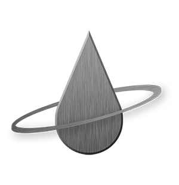

 

  <!-- <a href="https://dwpllc.vercel.app"> -->
    
  </a>

<h2 align="center">DWPLLC Server</h2>

  

    DWPLLC_Server is the main backend repo for Dark Water Privateers LLC's application.
     
     
    <a href="https://dwpllc.vercel.app"><strong>Learn More »</strong></a>
     
  

## Feature List

---

- Public: All users can access the Home page and learn about the organization
- Private: Logged in users can also access the Members page and...
  - add ships to their profile, view / edit / delete them
  - view other mebers's profile with their added ships

## Technologies Used

---

- Node
- Express
- Mongoose
- MongoDB

## Development Environment Setup

---

1.  Clone this repo.

    -        `https://github.com/suwanshree/dwpllc_server`

2.  Install required dependencies from the root directory (server).

    -        `npm install`

3.  Create a .env file in the root directory based on the .env.example found within the same directory.

4.  In the .env file, make sure MONGO_URI has correct link to org MongoDB database and JWT_SECRET has a strong secret.

5.  Start the services in the server directory, server should start and MongoDB Atlas should connect.

    -       npm run dev
